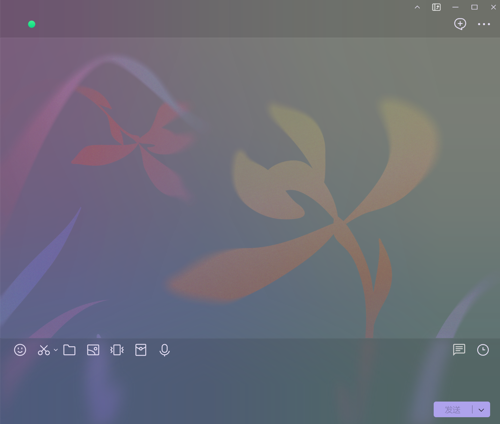
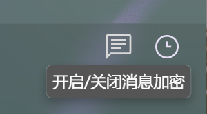
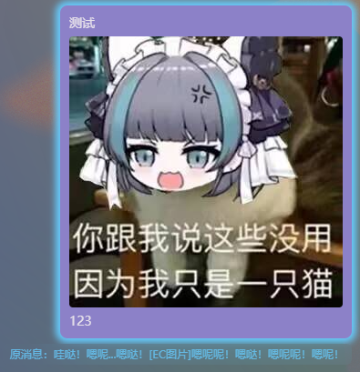
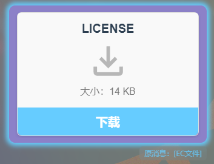

## 一款基于NTQQ Liteloader的加密聊天插件。

<!-- PROJECT SHIELDS -->

[![Contributors][contributors-shield]][contributors-url]
[![Forks][forks-shield]][forks-url]
[![Stargazers][stars-shield]][stars-url]
[![Issues][issues-shield]][issues-url]
[![MIT License][license-shield]][license-url]
[![LinkedIn][linkedin-shield]][linkedin-url]

<!-- PROJECT LOGO -->

  
  <h1 align="center">Encrypt Chat</h1>
  

    <a href="https://github.com/WJZ-P/LiteLoaderQQNT-Encrypt-Chat">查看Demo</a>
    ·
    <a href="https://github.com/WJZ-P/LiteLoaderQQNT-Encrypt-Chat/issues">报告Bug</a>
    ·
    <a href="https://github.com/WJZ-P/LiteLoaderQQNT-Encrypt-Chat/issues">提出新特性</a>
  

  

<h2 align="center">"将世界最后的空白刻印在斑驳心海
而我等蜉蝣只得抒发不足日的无奈"</h2>

## 目录

- [Encrypt Chat](#projectname)
    - [目录](#目录)
        - [上手指南](#上手指南)
            - [开发前的配置要求](#开发前的配置要求)
            - [**插件安装步骤**](#安装步骤)
        - [**使用方法**](#使用方法)
        - [版权说明](#版权说明)
        - [鸣谢](#鸣谢)
        - [重要声明](#重要声明)

## 上手指南

###### 开发前的配置要求

1. 请安装LiteLoader，项目地址为 https://github.com/LiteLoaderQQNT/LiteLoaderQQNT
   
2. 下面是社区开发的LiteLoader快捷安装脚本项目，新手请直接下载下面的即可。
   https://github.com/Mzdyl/LiteLoaderQQNT_Install/

###### 安装步骤

1. 下载release中的最新版本
2. 解压后把整个解压出来的文件夹拖动到Plugins目录下即可。
3. 重启QQ，LiteLoader会自动加载Encrypt Chat插件。

#### 注意，如果使用了上面的install脚本安装liteloader，QQ设置会自带插件商店，在插件商店里可以一键安装本插件。

# 使用方法

## 1. 打开QQ，随便选择一个聊天对象，当前不支持独立聊天窗口的加密，也就是说你需要在QQ左侧有好友栏，设置之类的那个页面使用加密功能。

  

## 2. 在聊天界面的输入栏右上方会有插件图标，点击即可启用，可以按Ctrl+E快速开关加密功能

  

## 3. 加密类型：
- ## 文字加密 
  - ### 打字，点击发送即可看到效果。显示的明文共有**六种**加密语，具体请在设置中查看。

- ## 图片加密 
  - ### 跟打字类似，直接发送即可。

- ## 文字加密 
  - ### 跟普通QQ上传文件的方式一样。需要在开启加密功能后再上传。由于限制只支持**20M**以下文件的发送。
  

### 加密对比图如下：

  
  
  

## 4.更多内容请在QQ设置中查看

## 版权说明

该项目签署了EPL-2.0 license
授权许可，详情请参阅 [LICENSE](https://github.com/WJZ-P/LiteLoaderQQNT-Encrypt-Chat/blob/main/LICENSE)

## 鸣谢

- [LiteLoader QQNT](https://github.com/LiteLoaderQQNT/LiteLoaderQQNT?tab=readme-ov-file)

## 重要声明
### 本项目仅供交流学习使用，**禁止**用于一切非法用途！任何问题概不负责。(｡•́︿•̀｡) 

### **因项目特殊性，不接受任何形式的赞助、捐赠等基于本项目的利益输送行为。**

## 📝 To Do List

- [x] **支持图片加密**
   - [x] 实现对图片文件的加密功能，保护用户隐私。

    
- [x] **支持文件加密**  
   - [x] 提供对文件格式的加密支持。

- [x] **消息使用 MD5 校验**
   - [x] 使用aes-256-gcm算法，自带哈希校验。

- [x] **支持修改主题色**  
   - [x] 允许用户自定义应用的主题颜色，提升用户体验。

- [ ] **支持单独群，QQ 用户单独密钥**  
   - [ ] 为不同的群组提供独立的加密密钥，确保群组安全。

- [x] **支持更多的语种**  
   - [x]  当前仅为bangboo语，后续增加喵喵语等

- [x] **增加开启快捷键** (已完成,Ctrl+E)
   - [x] ctrl+e比较合适

## 待修复bug

- 右键复制解密消息时，复制到的文本依然是原文
- 解密后如果是URL，URL不可点击
- 多开独立窗口时，只有主窗口的加密会生效。

# 如果您喜欢本项目，请给我点个⭐吧(๑>◡<๑)！

## ⭐ Star 历史

<!-- links -->

[your-project-path]:WJZ-P/LiteLoaderQQNT-Encrypt-Chat

[contributors-shield]: https://img.shields.io/github/contributors/WJZ-P/LiteLoaderQQNT-Encrypt-Chat.svg?style=flat-square

[contributors-url]: https://github.com/WJZ-P/LiteLoaderQQNT-Encrypt-Chat/graphs/contributors

[forks-shield]: https://img.shields.io/github/forks/WJZ-P/LiteLoaderQQNT-Encrypt-Chat.svg?style=flat-square

[forks-url]: https://github.com/WJZ-P/LiteLoaderQQNT-Encrypt-Chat/network/members

[stars-shield]: https://img.shields.io/github/stars/WJZ-P/LiteLoaderQQNT-Encrypt-Chat.svg?style=flat-square

[stars-url]: https://github.com/WJZ-P/LiteLoaderQQNT-Encrypt-Chat/stargazers

[issues-shield]: https://img.shields.io/github/issues/WJZ-P/LiteLoaderQQNT-Encrypt-Chat.svg?style=flat-square

[issues-url]: https://img.shields.io/github/issues/WJZ-P/LiteLoaderQQNT-Encrypt-Chat.svg

[license-shield]: https://img.shields.io/github/license/WJZ-P/LiteLoaderQQNT-Encrypt-Chat.svg?style=flat-square

[license-url]: https://github.com/WJZ-P/LiteLoaderQQNT-Encrypt-Chat/blob/main/LICENSE

[linkedin-shield]: https://img.shields.io/badge/-LinkedIn-black.svg?style=flat-square&logo=linkedin&colorB=555

[linkedin-url]: https://linkedin.com/in/shaojintian

